# UniqueTrip (MakeMyTrip Clone) — UML Diagrams

This document captures the system architecture, core data model, and key interaction flows using Mermaid UML.

## System Architecture

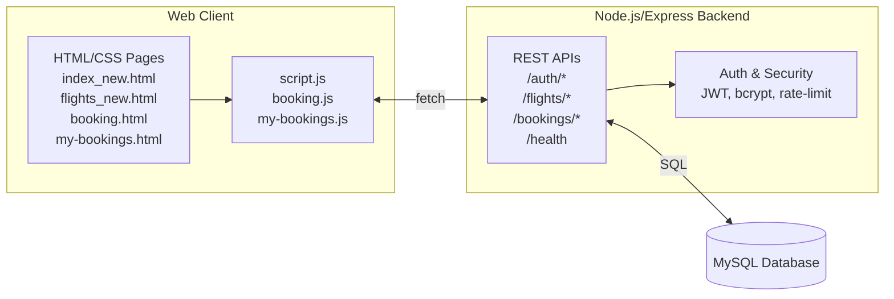

If the diagram doesn't render in your preview, see the rendered image:

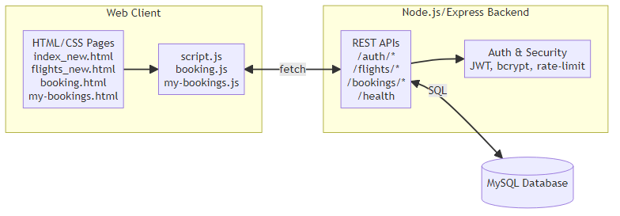

## Data Model (Logical)

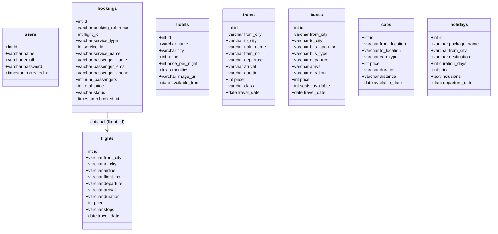

If the diagram doesn't render in your preview, see the rendered image:

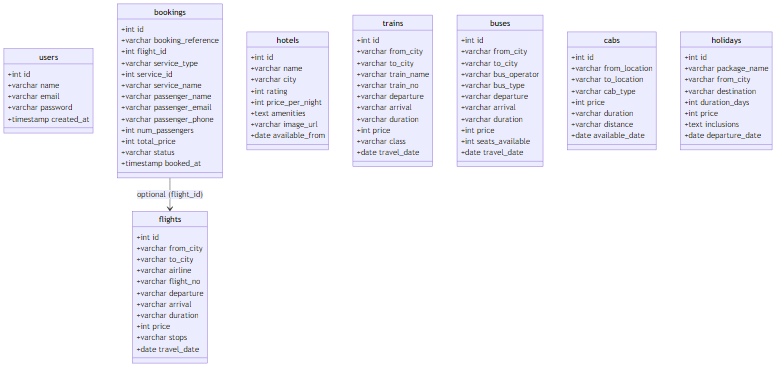

Notes:
- `bookings` supports both flight and non-flight services using `service_type`, `service_id`, and `service_name`. `flight_id` is used for flight bookings and may be null for others.

## Authentication Flow (Sequence)

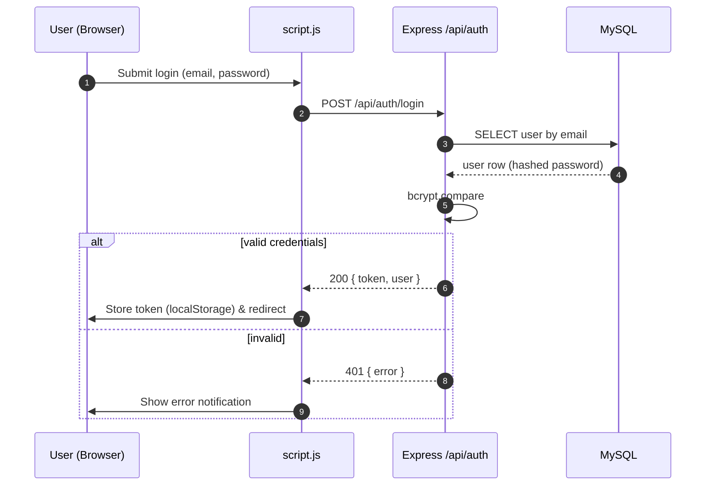

If the diagram doesn't render in your preview, see the rendered image:

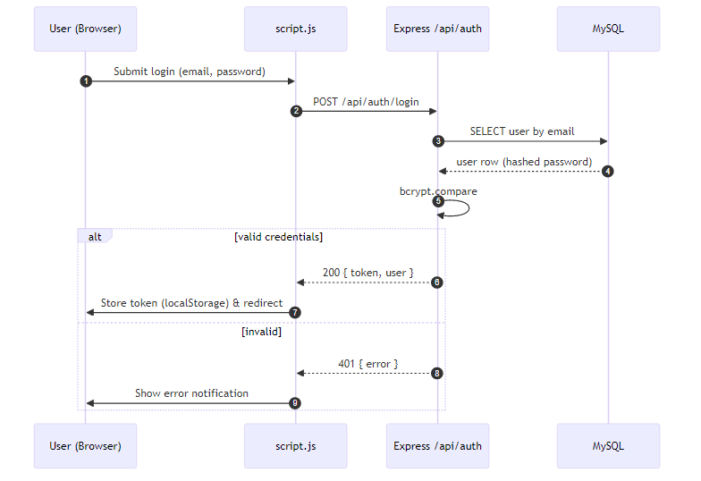

## Booking Flow — Flight

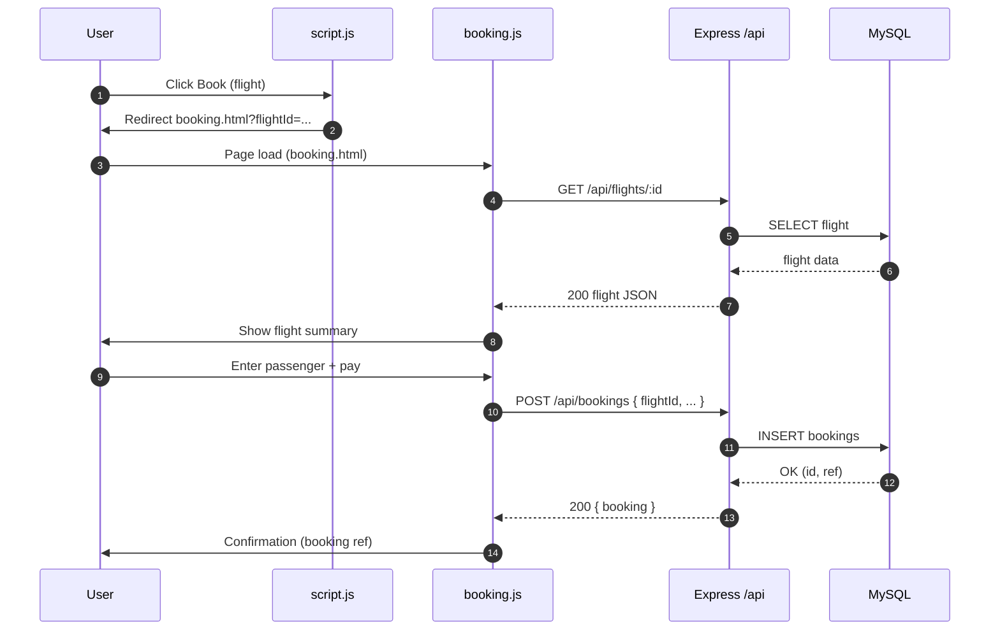

If the diagram doesn't render in your preview, see the rendered image:

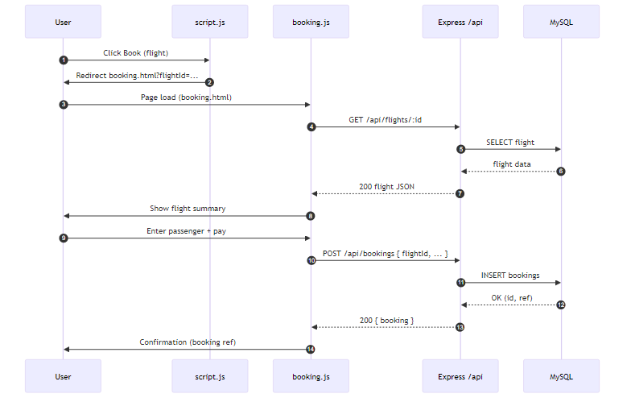

## Booking Flow — Generic Service (Hotels/Holidays/Trains/Buses/Cabs)

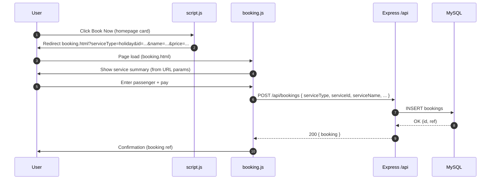

If the diagram doesn't render in your preview, see the rendered image:

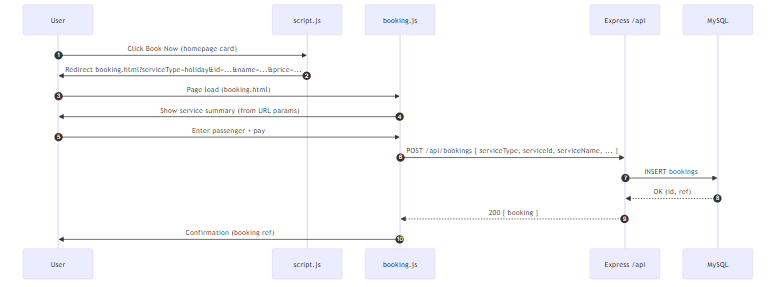

## Security Components

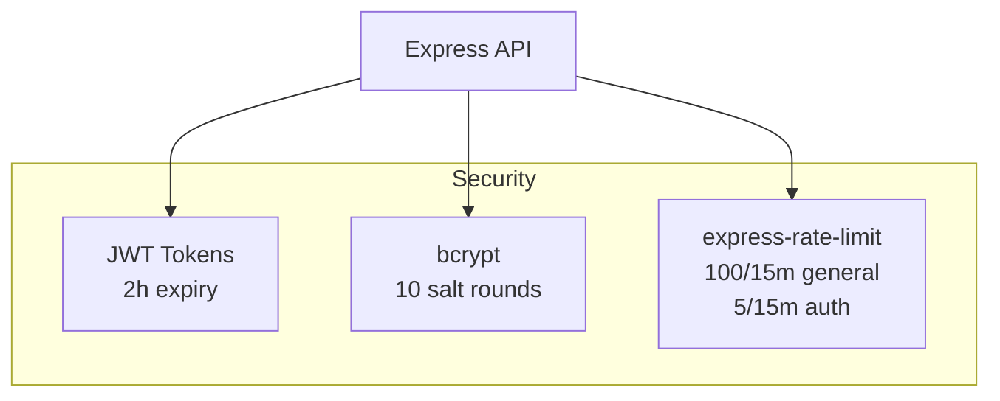

If the diagram doesn't render in your preview, see the rendered image:

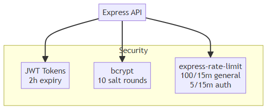

---

Quick view: Open this file in VS Code with Mermaid preview support, or copy diagrams into any Mermaid-compatible viewer.
