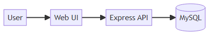
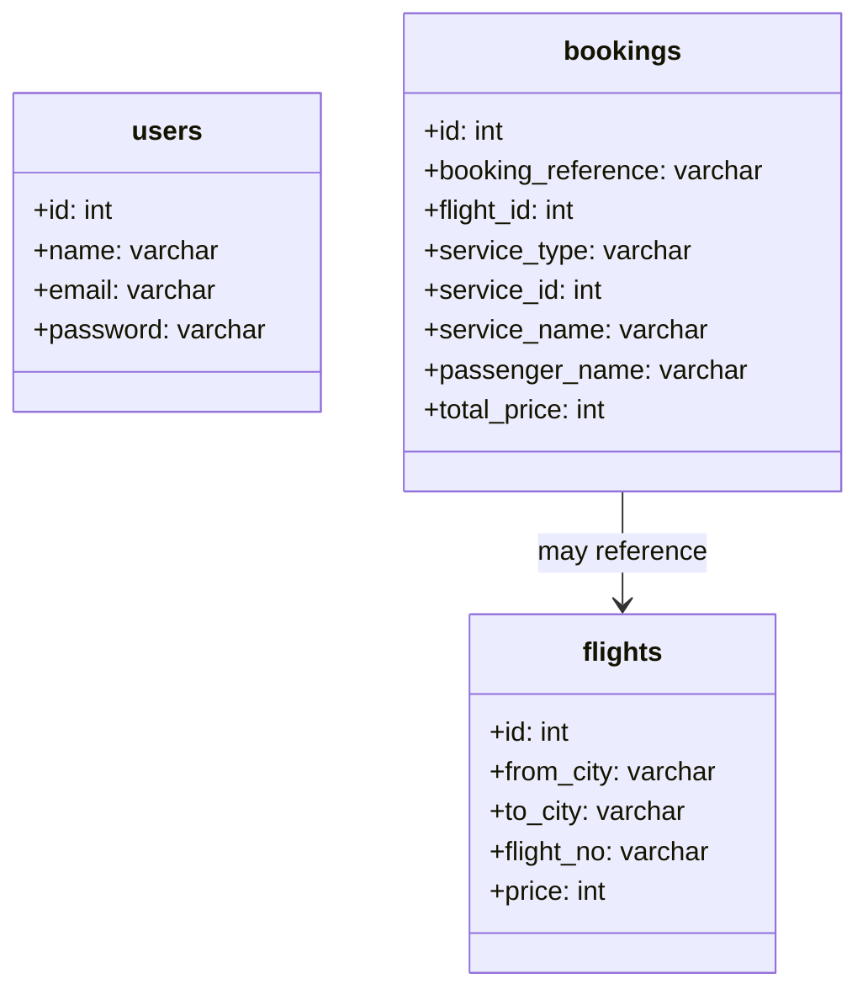
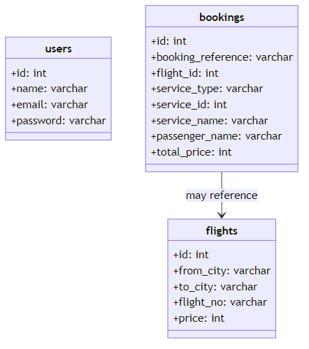
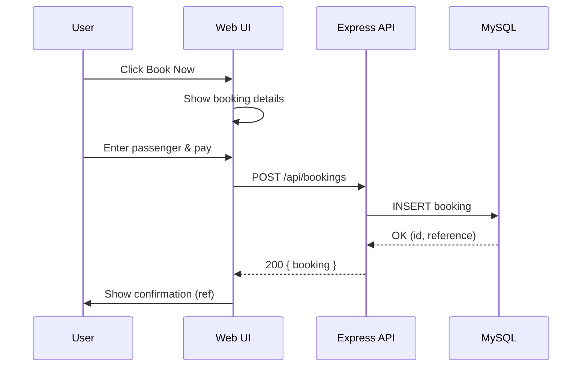
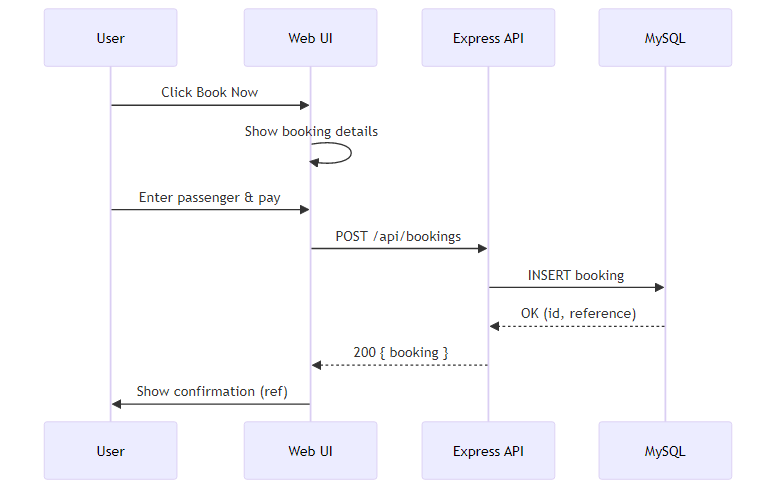

# UniqueTrip — Simple UML Overview

This is the shortest, easiest-to-explain version of the system diagrams. Each diagram includes a plain-language summary and a rendered image fallback.

## 1) Architecture (Big Picture)

- User uses the Web UI (HTML/CSS/JS pages)
- The UI calls the Express API
- The API reads/writes data in MySQL

Fallback image: 

---

## 2) Data Model (Essentials Only)

- users: accounts with name/email/password
- flights: basic flight info with price
- bookings: records a purchase; supports flight and non-flight via service fields

Fallback image (full data model also available in detailed doc): 

---

## 3) Booking Flow (End-to-End)

- User starts a booking
- UI collects details and calls the API
- API stores it in the database and returns a booking reference

Fallback image: 

---

For more detailed diagrams (all entities, flows, and security), see `uml-overview.md` in the same folder.
